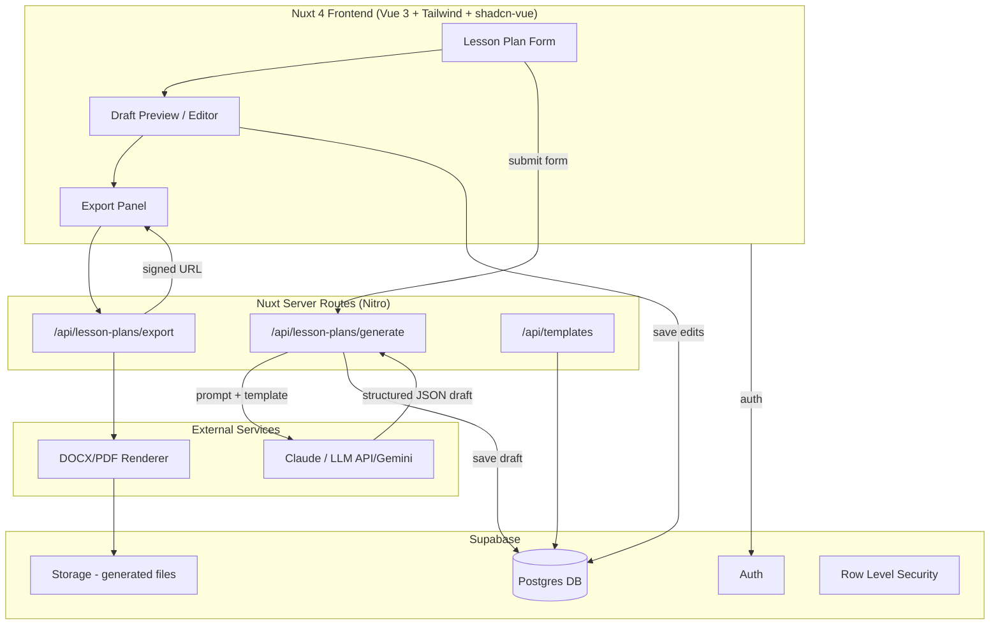
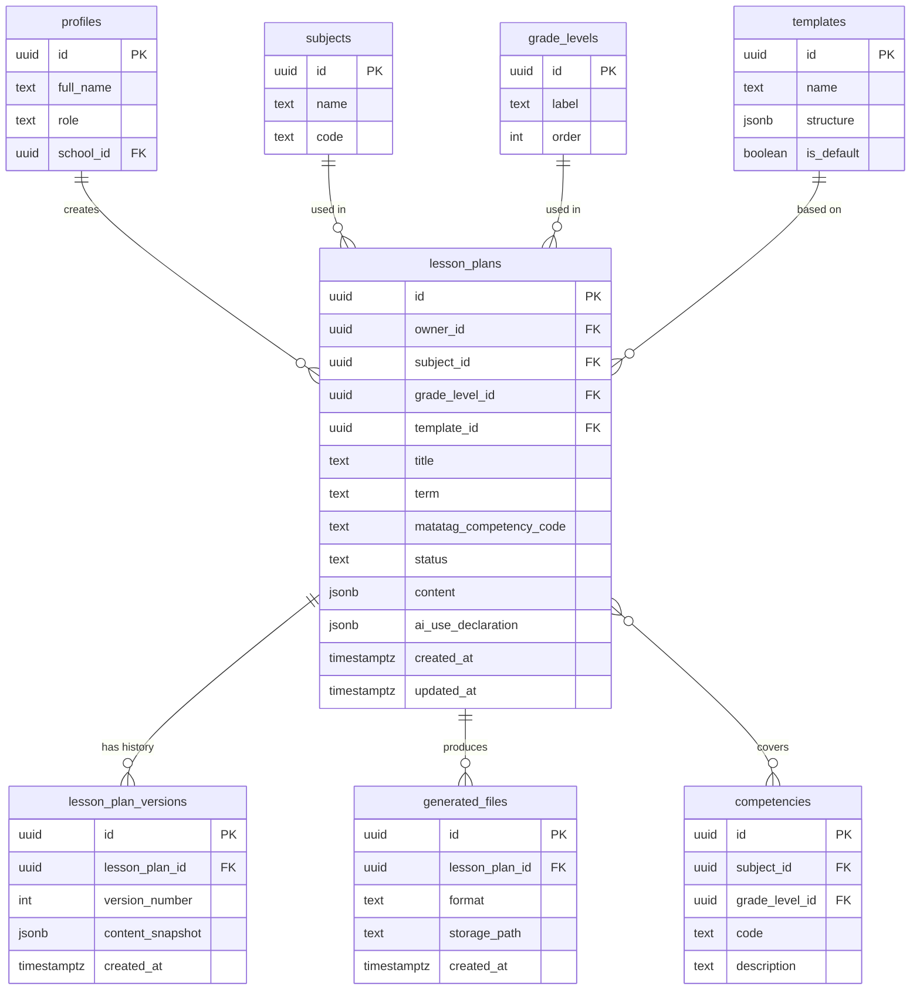

# Lesson Plan Docs Generator — Architecture & Build Plan
### Stack: Nuxt 4 + Vue 3 + TypeScript + Supabase — ILAW Format

> ILAW is DepEd's new single lesson-plan template for SY 2026–2027 (DepEd Order No. 16, s. 2026), replacing the old DLL/DLP. It has four sections: **I**ntentions, **L**earning Experience, **A**ssessing Learning, **W**ays Forward — plus a required AI-use declaration when AI assisted in drafting (DepEd Order No. 3, s. 2026, Annex A). Teachers may still use the old DLL/DLP through the end of Term 1, SY 2026–2027; full ILAW compliance is required from Term 2 onward.
>
> Assumption: teachers log in, fill a structured form (subject, grade level, MATATAG competency code, term), an LLM drafts the four ILAW sections, the teacher edits and declares AI use, then exports to DOCX/PPTX. Adjust if your use case differs.

---

## 1. High-Level Architecture



**Flow in words:**
1. Teacher fills a structured form (not free text) — subject, grade, topic, duration, competencies.
2. Nuxt server route builds a prompt from the form + a chosen template, calls the LLM API, and gets back **structured JSON** (not raw prose) matching your lesson-plan schema.
3. Draft is saved to Supabase, teacher edits it in a rich editor.
4. On export, a server route renders the final content into DOCX/PDF and stores the file in Supabase Storage; the client gets a signed download URL.

---

## 2. Database Design (Supabase / Postgres)



**Notes on the schema:**
- `content jsonb` on `lesson_plans` should mirror the four ILAW sections directly, e.g.:
  ```json
  {
    "intentions": { "learning_competency": "", "objectives": "" },
    "learning_experience": { "activities": [ { "phase": "Motivation", "description": "" } ] },
    "assessing_learning": { "formative": "", "summative": "" },
    "ways_forward": { "reflection": "", "remediation": "", "enrichment": "" }
  }
  ```
  Keeping it schema-shaped (rather than one text blob) is what lets the editor show four distinct sections and lets the exporter drop each straight into the matching placeholder in the DOCX/PPTX template.
- `ai_use_declaration jsonb` — DepEd Order No. 3, s. 2026 Annex A requires teachers to declare how AI was used in preparing the plan. Store this as its own field (e.g. `{ "tool": "...", "sections_ai_assisted": [...], "teacher_edited": true }`) rather than folding it into `content`, since it's compliance metadata, not lesson content, and you'll likely want to report on it separately.
- `matatag_competency_code` and `term` (Term 1/2/3) support DepEd's three-term calendar and MATATAG competency alignment — filterable/reportable independent of subject/grade.
- `templates.structure jsonb` defines section order — keep ILAW as the default template but leave room for a legacy DLL/DLP template, since DO 16 allows the old format through end of Term 1, SY 2026–2027.
- `lesson_plan_versions` gives you undo/history without bloating the main row — write a new version row on every save (or every N minutes / on export).
- `competencies` maps to MATATAG competency codes per subject/grade level, useful for autofill and later coverage reporting.
- RLS: `owner_id = auth.uid()` on `lesson_plans` and `lesson_plan_versions`; `profiles` gated by `id = auth.uid()`; `subjects`/`grade_levels`/`templates`/`competencies` are read-only public reference tables, writable only by an `admin` role check via a custom claim or a `roles` table.

---

## 3. Suggested Tools & Libraries

| Concern | Options |
|---|---|
| Frontend framework | Nuxt 4, Vue 3, TypeScript (already your stack) |
| UI components | shadcn-vue + Tailwind v4 (consistent with your other projects) |
| Rich text editing | Tiptap (Vue bindings) — best fit for structured, section-based editing |
| State/auth | Pinia auth store + `@supabase/ssr` for Nuxt |
| LLM generation | Anthropic Claude API (Messages API, JSON-mode style prompting for structured output) |
| DOCX export | `docx` (npm) or `docxtemplater` with a `.docx` template file — good for matching the official ILAW layout exactly |
| PPTX export | `pptxgenjs` — most ILAW tools also offer a presentation-slide export alongside the DOCX for classroom use |
| PDF export | `pdf-lib` for programmatic layout, or Puppeteer/Playwright to render an HTML template to PDF if you want CSS-based styling |
| File storage | Supabase Storage (private bucket, signed URLs) |
| Background jobs (optional) | Supabase Edge Functions or a Nitro server task queue if generation/export gets slow |
| Validation | Zod (shared between form and server route) |
| Testing | Vitest (you already have a workspace pattern for this) |

**Why structured JSON output from the LLM rather than raw text:** it lets you render the same content into DOCX, PDF, or an in-app editor without re-parsing prose, and lets teachers edit individual sections instead of a monolithic document.

---

## 4. Build Roadmap

**Phase 1 — Foundation**
- Supabase project: schema above, RLS policies, seed `subjects`, `grade_levels`, one default `template`.
- Nuxt auth (teacher login, profile creation on signup trigger.

**Phase 2 — Core CRUD**
- Lesson plan list/detail pages, manual create/edit (no AI yet) to validate the schema and editor UX.
- Template picker driven by `templates.structure`.

**Phase 3 — AI Generation**
- `/api/lesson-plans/generate` server route: builds prompt from form inputs (subject, grade, MATATAG code, term) + ILAW template structure, calls Claude API, validates response against a Zod schema matching the four ILAW sections, saves as a new lesson plan (status: `draft`).
- Add a "regenerate section" action (regenerate just Learning Experience or Ways Forward, not the whole plan).
- Require the teacher to fill/confirm `ai_use_declaration` before export — this is a DepEd compliance step, not optional metadata.

**Phase 4 — Export**
- `/api/lesson-plans/export`: takes a lesson plan, renders via `docx`/`docxtemplater` for Word and `pptxgenjs` for slides, uploads to Storage, returns signed URLs.
- Export history via `generated_files` (track `format`: `docx` | `pptx` | `pdf`).

**Phase 5 — Polish**
- Version history UI (diff between `lesson_plan_versions`).
- Multi-template support, sharing/collaboration if multiple teachers need to co-edit.
- Optional: curriculum competency tagging + coverage reports.

---

## 5. Key Risks to Design Around Early
- **LLM output drift:** always validate the model's JSON against a strict schema server-side before saving; reject/retry on mismatch rather than trusting free-form output.
- **Template fidelity:** if the exported DOCX must match an exact official format, a `docxtemplater` template file (with placeholders) is far more reliable than generating DOCX structure from scratch.
- **Editing vs. regenerating:** decide early whether edited content locks a section from being overwritten by "regenerate" — otherwise teachers will lose manual edits.
